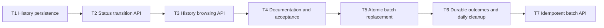

# Inventory Status Transition Implementation Tasks

Status: Durable idempotency and daily cleanup implemented and verified locally; ready for review.

The original T1–T4 below record the delivered single-item baseline. T5 supersedes their single-item
transition contract and was the batch implementation increment; historical references describe
the original delivery rather than authorizing recreation of shipped migrations.

This plan implements `requirements.md` through the decisions in `design.md`. Each task is one safe
commit containing its production change, the automated tests that prove it, and any documentation
needed to keep that increment reproducible.

## 1. Execution contract

- T1 through T5 are complete. Implement T6 and T7 from §5, including persistence, daily cleanup,
  the required key contract, tests, OpenAPI and README. Do not recreate shipped work.
- Complete one task, satisfy its entire DoD, and run the full verification lifecycle before
  considering its proposed commit ready for review.
- Before every commit run `mvn -B -ntp clean verify` without test, integration-test, migration, or
  formatting skip flags. If Spotless fails, run `mvn spotless:apply` and repeat the full clean
  verification.
- Use explicit Java types for local variables and enhanced `for` loops. Preserve all unrelated
  code and existing API behavior.
- Keep the exact API, problem, persistence, and timestamp contracts from `design.md`. A discovered
  gap or changed decision goes to the spec before code.
- Update `OpenApiIT` in the same task that changes an endpoint so every intermediate commit remains
  green and its generated contract is accurate.
- Container configuration and runtime behavior are unchanged. Final acceptance uses the mandatory
  Maven lifecycle and does not rerun the container smoke suite.
- The proposed titles use Conventional Commits and define the intended scope of each commit.

## 2. Dependencies and delivery order

The order is intentionally linear. T1 establishes a valid migrated schema and mapped history
entity. T2 uses that foundation to deliver the atomic transition write path. T3 exposes the rows
created by T2. T4 documents the completed contract and performs final acceptance. Every checkout at
a task boundary builds, migrates, and passes all tests for the behavior implemented so far.

## 3. Implementation tasks

### T1 - Establish status-history persistence

**Commit:** `feat: add inventory status history persistence`

**Depends on:** None.

**Refs.** `requirements.md` AC2.1, AC2.4-AC2.5, AC3.8-AC3.9;
`design.md` §4.1-§4.5, §6, §7.1, §8.2.

**Scope.**

- Add the append-only `V2__create_inventory_status_history.sql` migration with the internal
  identity, copied serial number, source and target statuses, PostgreSQL-authored timestamp,
  constraints, and default-order index from `design.md` §4.1.
- Add the immutable `InventoryStatusHistory` JPA entity and the base
  `InventoryStatusHistoryRepository` mapping. Do not add the transition use case or history API in
  this task.
- Extend migration and persistence integration coverage, including test cleanup for the retained
  history table.

**DoD.**

- V1 is unchanged, and Flyway records V2 exactly once in
  `inventory.flyway_schema_history`; no application or Flyway object is created outside the
  Inventory-owned `inventory` schema.
- `MigrationIT` proves `inventory.inventory_status_history` has a generated `bigint` identity,
  `serial_number`, `status_from`, `status_to`, and DB-defaulted `timestamptz transitioned_at`, plus
  `idx_inventory_status_history_transitioned_at_id` in the documented order.
- Direct inserts prove PostgreSQL generates a non-null timestamp and identity, while constraints
  reject invalid or overlength serials, undefined source or target statuses, null fields, and
  equal source/target statuses.
- Catalogue metadata inspection proves no foreign key links history to `inventory_items`. A valid
  history row remains after its current inventory item is deleted and after a second application
  context starts against the same database.
- `InventoryStatusHistory` maps every column with the documented type and immutability flags, has
  no public setter or mutation method, and never changes V1's `InventoryItem` mapping.
- The other-service sentinel remains unchanged, Hibernate schema validation succeeds, and test
  cleanup explicitly clears `inventory_status_history` and `inventory_items` without relying on
  cascade behavior or test order.
- No `pg_trgm` extension, item foreign key, history API, transition rule, or new dependency is
  introduced.
- `mvn -B -ntp clean verify` finishes with `BUILD SUCCESS` against PostgreSQL 18.4.

### T2 - Deliver the atomic status-transition API

**Commit:** `feat: transition inventory item status`

**Depends on:** T1.

**Refs.** `requirements.md` AC1.1-AC1.8, AC2.1-AC2.3, AC4.1-AC4.3,
AC5.1-AC5.4; `design.md` §2.1, §2.3-§2.4, §3.1-§3.3, §5, §7, §8.1-§8.3.

**Scope.**

- Add the exhaustive `InventoryStatus.canTransitionTo` behavior and the dedicated
  `InventoryItem.setStatus` mutation while leaving `replaceDetails` unchanged.
- Add the pessimistically locked repository lookup, `InventoryStatusUpdateDTO`, service-layer
  invalid-transition exception, transactional service orchestration, and one history insert per
  successful transition.
- Add `PATCH /api/v1/inventory/{serialNumber}/status`, its stable Problem Details mapping, OpenAPI
  annotations, and unit/full-stack/concurrency tests.
- Update `OpenApiIT` in this commit for the new path and operation while retaining all existing
  CRUD contract assertions. Do not add the history collection yet.

**DoD.**

- `InventoryStatusTest` runs without Spring and covers all 36 source/target combinations plus null
  targets; its expected set exactly matches the matrix in `requirements.md`, every same-status
  pair is false, and every transition from `RETIRED` is false.
- `InventoryItemTest` proves the dedicated mutation changes only status, while the existing
  replacement method still accepts every defined target without consulting the matrix.
- `InventoryServiceTest` uses Mockito to prove `setStatus` loads through
  `findForUpdateBySerialNumber`, captures the actual previous status, mutates the managed item, and saves
  exactly one history entity with the correct serial/source/target values in the allowed case.
- The same unit suite proves not-found, null, same-status, and disallowed paths do not mutate the
  item or save history; existing create, get, list, replace, and delete tests remain green, and
  `PUT` never calls the history repository.
- `InventoryIT` parameterizes the externally observable transition matrix: permitted pairs return
  `204` with no body and persist only the target status, while same-status and disallowed pairs
  return the exact `409 INVALID_INVENTORY_STATUS_TRANSITION` problem and leave both tables
  unchanged.
- Every successful `PATCH` creates exactly one row whose serial, source, and target match the
  committed transition and whose PostgreSQL timestamp falls within bounds captured around the
  request. Serial, type, and name remain unchanged.
- Controlled PostgreSQL failure tests prove both rollback directions: a failed history insert
  leaves the inventory status unchanged, and a failed item update leaves no committed history row.
  Test fault injection is removed during cleanup and does not alter production migrations.
- Missing or null status, undefined tokens, malformed JSON, unknown members, invalid serial paths,
  unsupported request media, missing items, and unexpected failures return their documented
  Problem Details responses and create no history. `PATCH` remains unsupported on the collection
  and item paths without `/status`.
- A controlled concurrent integration test proves the pessimistic row lock serializes two
  dedicated transitions: committed history forms a valid source-to-target chain, the final item
  matches the last successful row, and no lost or stale-source transition is recorded.
- Regression assertions prove `PUT` still accepts a transition the dedicated endpoint would reject,
  returns its existing `200` representation, and creates no history row.
- `OpenApiIT` proves operation ID `transitionInventoryStatus`, the one-field required request
  schema, all status values, empty `204`, applicable problem responses, no security scheme, and no
  undocumented PATCH operation.
- The endpoint processes requests without credentials, architecture tests keep controllers away
  from repositories, and `mvn -B -ntp clean verify` finishes with `BUILD SUCCESS`.

### T3 - Deliver paginated status-history browsing

**Commit:** `feat: browse inventory status history`

**Depends on:** T2.

**Refs.** `requirements.md` AC2.4, AC3.1-AC3.9, AC5.2-AC5.4;
`design.md` §1.1-§1.3, §2.2-§2.4, §3.4, §4.2-§4.5, §5.2, §7, §8.1-§8.3.

**Scope.**

- Add `InventoryStatusHistorySortField`, the literal case-sensitive substring specification, and
  the read-only history-list method in the existing `InventoryService`.
- Add `InventoryStatusHistoryDTO`, `InventoryStatusHistoryConverter`, and the dedicated
  `InventoryHistoryController` at `GET /api/v1/inventory-history` with its own strict query
  allowlist.
- Add unit, PostgreSQL full-stack, routing, and OpenAPI coverage for the complete history
  collection contract.

**DoD.**

- `InventoryStatusHistoryConverterTest` runs without Spring and proves the response maps exactly
  `serialNumber`, `statusFrom`, `statusTo`, and `timestamp`; neither the DTO nor generated schema
  exposes the internal identity.
- `InventoryServiceTest` proves every public sort name maps to the intended entity property,
  appends internal `id` in the requested direction, defaults to `timestamp DESC, id DESC`, and
  delegates filtering and paging without in-memory collection processing.
- Repository/full-stack tests prove `serialNumber` performs a case-sensitive literal contains
  query. Mixed case does not match, while `_`, `%`, and the escape character are treated as
  literals rather than SQL wildcards; no join to the current item is required.
- An unauthenticated request without parameters returns `200`, page number `0`, size `20`, accurate
  totals, non-null `content`, nested `page` metadata, and deterministic newest-first ordering.
- Valid custom pages and sizes, an empty table, a filter with no matches, and a page beyond the end
  return the documented envelope. History for a deleted item remains present in unfiltered and
  matching filtered results.
- Ascending and descending requests work for `serialNumber`, `statusFrom`, `statusTo`, and
  `timestamp`; duplicate public values and equal timestamps prove the internal identity
  tie-breaker without exposing it.
- Negative or nonnumeric pages, zero/over-maximum/nonnumeric sizes, blank or overlength filters,
  unknown or repeated parameters, unsupported sort names, and unsupported directions each return
  a `400 VALIDATION_FAILED` problem naming the rejected field.
- The literal top-level route does not shadow item retrieval: an item whose exact serial number is
  `history` remains retrievable through `GET /api/v1/inventory/history` while history collection
  requests use only `GET /api/v1/inventory-history`.
- `OpenApiIT` proves the completed seven-operation API, operation ID
  `listInventoryStatusHistory`, all five query parameters and defaults, the four-field paged
  response, applicable errors, empty PATCH response, and absence of security schemes. All previous
  CRUD and transition assertions remain.
- Existing inventory list semantics, `PUT` behavior, transition history creation, and Problem
  Details responses remain unchanged, and `mvn -B -ntp clean verify` finishes with
  `BUILD SUCCESS`.

### T4 - Document workflows and complete acceptance

**Commit:** `docs: document inventory status workflows`

**Depends on:** T3.

**Refs.** `requirements.md` AC5.3-AC5.4; `design.md` §2.4, §6-§8, §10.

**Scope.**

- Update the README with executable status-transition and history-browsing examples and the new
  invalid-transition behavior.
- Perform final requirements/design/task traceability and clean verification without changing
  container configuration or introducing unrelated refactoring.

**DoD.**

- The README documents both new paths, the exact transition request, `204` success, `409` invalid
  transition, history response fields, pagination defaults and limits, partial serial filtering,
  all sort fields, default newest-first order, and history retention after item deletion.
- Executable examples include one permitted transition, one rejected transition, a default history
  page, and a filtered/sorted page. Payloads, parameters, paths, statuses, and response descriptions
  match OpenAPI and contain no credentials or production secrets.
- The generated OpenAPI document and README agree on operation paths, status enum values, field
  names, response codes, page defaults, sort allowlists, and error codes; no stale statement says
  all PATCH operations or history retrieval are unsupported.
- The traceability table in §4 covers every acceptance criterion with a task whose DoD would fail
  if that behavior regressed, and every task's `Refs.` points to existing requirement and design
  sections.
- No Dockerfile, Compose, container script, dependency, database role/schema bootstrap, health
  configuration, or unrelated public API is changed; the container smoke suite is not required for
  this feature-only acceptance.
- `mvn -B -ntp clean verify` runs from the repository root without skip flags and finishes with
  `BUILD SUCCESS`; unit, migration, full-stack, OpenAPI, architecture, and formatting checks report
  no failure or skipped required suite.

### T5 - Replace the single-item endpoint with atomic batches

**Commit:** `feat: transition inventory statuses in atomic batches`

**Depends on:** Delivered T1–T4.

**Verification:** `mvn -B -ntp clean verify` completed with `BUILD SUCCESS` on 2026-09-08;
unit, PostgreSQL 18.4 integration, OpenAPI, architecture, and formatting checks passed without
skip flags. This records the original batch verification; T6–T7 extend that baseline.

**Refs.** `requirements.md` AC1.1-AC1.17, AC2.1-AC2.5, AC3.1-AC3.9, AC4.1-AC4.3,
AC5.1-AC5.4; `design.md` §2.1-§2.4, §3.1-§3.4, §4, §5, §6-§8, §10.

**Scope.**

- Replace the existing status route with `PATCH /api/v1/inventory/status` accepting a direct array
  of 1–100 unique serial/status objects. Keep operation ID and empty `204` success.
- Extend input validation, introduce the model command and batch exception/response records within
  existing layers, lock rows in ascending serial order, collect all lifecycle failures in request
  order before mutation, and commit all status/history writes in one transaction.
- Update existing transition tests to use arrays and add batch-specific regression coverage.
  Keep the matrix, history read behavior, CRUD semantics, dependencies, and migrations unchanged.
- Update OpenAPI and README in this same increment and run final full verification.

**DoD.**

- All 36 transition pairs retain their previous permitted/rejected outcomes through one-element
  arrays; null targets remain disallowed by the enum. Successful multi-item requests assert empty
  `204`, target statuses, unchanged serial/type/name, and exactly one correct history row per item
  with a bounded PostgreSQL-authored timestamp.
- Matrix and concurrency assertions prove `AVAILABLE` is the only source that can become
  `RESERVED`, only one competing reservation claim succeeds, cancellation permits
  `RESERVED` to `AVAILABLE`, and direct `AVAILABLE` to `RENTED` remains permitted. Post-rental
  assertions prove `RENTED` can move only to `INSPECTION_REQUIRED` and availability returns only
  after a passing inspection or completed maintenance; inspection and maintenance retain their
  permitted retirement paths.
- A batch mixing valid, missing, same-status, and forbidden entries returns `409` and every failed
  entry exactly once in original index order, with exact serial, requested status, code, and
  message. Valid entries do not appear in `failedItems`; every item and all history stay unchanged.
- A batch whose only failures are missing items returns `404` with all missing entries and no
  writes, including when other entries could transition. Same-status and disallowed-only batches
  return the stable `409` Problem Details fields and required failure list.
- Input tests assert `400` and no writes for non-array bodies, empty arrays, 101 entries, null
  entries, missing/null/invalid serial or status, unknown tokens/members, and duplicates (including
  identical targets). Exactly 100 valid unique entries succeed. Parsed validation errors have
  indexed violations; invalid input mixed with a lifecycle conflict returns only input errors.
- Unsupported media and unexpected server errors retain sanitized Problem Details. The removed
  single-item status path has no PATCH mapping; other inventory paths remain unsupported for
  PATCH except the new literal route. CRUD for an item named `status` still works.
- Mockito service tests prove deterministic serial lock order, all-entry validation before any
  mutation/history write, capture of previous statuses, and failure collection in request order.
- PostgreSQL tests inject failures on a later batch history insert and a later item update and
  prove both entire tables roll back, including earlier writes. Concurrent overlapping batches
  with reversed request order serialize; history chains remain valid and reflect final statuses.
- Existing migration/schema ownership and history-retention tests remain green, as do all history
  paging/filter/sort/error/visibility tests and unrestricted `PUT` regressions with no history.
- `OpenApiIT` asserts the replacement route only, unchanged operation ID, direct array and 1–100
  bounds, both required fields, all status values, failure-entry fields, `404`/`409` batch schemas,
  generic input/server schemas, empty `204`, unchanged history contract, and no authentication.
- README examples use the exact array contract and describe bounds, duplicate rejection, atomicity,
  input-validation precedence, and the complete failed-item response with status precedence.
- `ArchitectureTest` retains all existing dependency rules; no migration or dependency changes are
  introduced. `mvn -B -ntp clean verify` finishes with `BUILD SUCCESS` without skip flags.

## 4. Acceptance-criteria traceability

The original trace below remains applicable to unchanged behavior. T5 supersedes the single-item
assertions for AC1.1–AC1.8, AC2.1–AC2.3, and AC5.1–AC5.3; its DoD explicitly requires the
baseline regression suites for all remaining criteria. AC1.9–AC1.12 trace to T5 input-boundary,
aggregate-failure, mixed-status, and validation-precedence assertions respectively.

| Acceptance criteria | Primary task and regression-sensitive DoD |
| --- | --- |
| AC1.1 | T2: permitted matrix requests assert persisted target plus empty `204` |
| AC1.2 | T2: enum unit matrix and parameterized API matrix cover every source/target pair |
| AC1.3 | T2: item and integration assertions compare unchanged serial, type, and name |
| AC1.4-AC1.5 | T2: same/disallowed requests assert exact `409`, unchanged item, and no history |
| AC1.6 | T2: missing locked lookup asserts `404`, no upsert, and no history |
| AC1.7-AC1.8 | T2: body/media/path rejection matrix asserts documented `400`/`415` and no history |
| AC1.13-AC1.15 | T5: exhaustive matrix and concurrency tests assert the single reservation availability gate, cancellation release, and direct rental path |
| AC1.16-AC1.17 | T5: exhaustive matrix tests assert mandatory post-rental inspection and availability only after inspection or maintenance, with retirement paths retained |
| AC2.1 | T2: successful transition asserts exactly one row with all four required business values |
| AC2.2 | T2: transaction and persistence-failure tests assert item/history all-or-nothing behavior |
| AC2.3 | T2: every rejected and failed request asserts no history insert |
| AC2.4 | T1 and T3: persistence and API tests assert history survives and remains visible after deletion |
| AC2.5 | T1: schema metadata and sentinel assertions confine V2 to `inventory` |
| AC3.1-AC3.2 | T3: default/custom page tests assert bounds, envelope, totals, and metadata |
| AC3.3 | T3: case-sensitive literal substring tests include mixed case and SQL wildcard characters |
| AC3.4-AC3.5 | T3: all fields/directions and default timestamp/identity ordering are asserted |
| AC3.6 | T3: empty/no-match/past-end requests assert `200` with empty `content` |
| AC3.7 | T3: complete invalid-query matrix asserts `400` and the rejected field |
| AC3.8 | T3: DTO, JSON, and OpenAPI assertions expose exactly four fields and no identity |
| AC3.9 | T3: deleted-item history remains present in matching collection results |
| AC4.1-AC4.3 | T2: existing `PUT` regression asserts unrestricted status, existing response, and no history |
| AC5.1 | T2: invalid-transition handler test locks exact RFC 9457 fields and stable code |
| AC5.2 | T2 and T3: transition/history failure matrices assert the existing Problem Details contract |
| AC5.3 | T2 and T3: same-commit `OpenApiIT` assertions cover both operations and schemas |
| AC5.4 | T2 and T3: unauthenticated full-stack requests reach both operations |

No acceptance criterion is deferred to documentation alone. T4 checks documentation and final
traceability after T1-T3 made the baseline functional criteria executable and
regression-sensitive. The idempotency criteria trace to T6–T7 below.

## 5. Idempotency implementation increments

T6 depends on completed T5. T7 depends on T6. Each task is one safe commit; existing T1–T5 describe the delivered baseline, with request examples updated to the required key in T7.

### T6 - Persist request outcomes and clean expired records daily

**Commit:** `feat: persist status transition outcomes and clean expired requests`

**Depends on:** T5.

**Refs.** AC6.2, AC6.3, AC6.7, AC7.1–AC7.4; `design.md` §9.3–§9.4.

**DoD.** V3 creates the Inventory-owned ledger with UUID, fingerprint, terminal status, JSONB snapshot, timestamps, expiry index and no item foreign key. Migration tests assert constraints, ownership, repeated migration safety and preservation of the other-service sentinel. Real PostgreSQL tests prove completed outcomes survive a second context. Cleanup tests prove daily UTC defaults, only expired rows deleted, at most 1000 per transaction, locked rows skipped, multiple cleanup workers safe, history/unexpired rows untouched, and no new chunk after the runtime budget. Metrics tests observe counters, duration and backlog without identifier labels. `mvn -B -ntp clean verify` passes.

### T7 - Require keys and replay atomic batch outcomes

**Commit:** `feat: make inventory status retries idempotent`

**Depends on:** T6.

**Refs.** AC6.1–AC6.9, AC7.3; `design.md` §9.1–§9.4; existing US1–US5 regression coverage remains required.

**DoD.** Tests assert missing/invalid/repeated headers return 400, UUID case normalization, invalid input does not consume a key, and fingerprints ignore JSON whitespace/property order while preserving array order/serial case/status. Integration tests assert 204 replay adds no history after item changes/deletion, saved 404/409 failure envelopes replay unchanged after conditions change, different payload gets 422, deterministically held execution locks return immediate busy 409 with Retry-After even for mismatches, and independent keys execute. Fault injection proves inventory/history and ledger failures roll back every write and allow same-key retry. Committed response loss and application restart replay safely. Expired records accept changed payload before cleanup. Terminal responses expose stable seven-day expiry and correct replay flags. OpenAPI and README document headers, statuses, retry guidance and coordinated cutover. Existing batch matrix, atomicity, input validation, history and PUT regression tests pass with fresh keys. `mvn -B -ntp clean verify` reports BUILD SUCCESS, and spec self-evaluation is written.

| Additional criteria | Regression-sensitive DoD |
| --- | --- |
| AC6.1–AC6.9 | T7: header validation, semantic replay, mismatch/busy errors, rollback/restart/expiry tests and documented retry/cutover contract |
| AC7.1–AC7.2 | T6: daily UTC defaults, bounded chunks, separate transactions, locked rows and runtime-budget tests |
| AC7.3 | T6 cleanup preservation and T7 expiry-before-cleanup assertions |
| AC7.4 | T6 metrics tests for counters, duration, backlog and absence of identifier labels |

**T6–T7 verification:** `mvn -B -ntp clean verify` reported `BUILD SUCCESS` on 2026-09-08: 42 unit/architecture tests and 154 PostgreSQL integration/OpenAPI tests passed, with no failures, errors or skips. Spotless passed. Changes remain uncommitted in the working tree.
