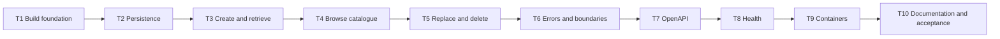

# Inventory Service Skeleton Implementation Tasks

Status: Task decomposition defined; ready for implementation.

This plan implements `requirements.md` through the decisions in `design.md`. Each task is one safe
commit and includes the production change, its automated checks, and any documentation needed to
make that increment reproducible.

## 1. Execution contract

- Execute T1 through T10 in numeric order. Do not combine tasks or split implementation from the
  tests that prove it.
- Complete one task, satisfy its entire DoD, and create its proposed commit before starting the
  next task.
- Run `mvn -B -ntp clean verify` without skip flags before every commit. If Spotless fails, run
  `mvn spotless:apply` and repeat the full verification command.
- T10 also runs `mvn -B -ntp clean verify`, the Maven Wrapper lifecycle, and the container smoke
  script as final clean-checkout acceptance.
- Keep the exact versions and contracts from `design.md`. A discovered gap or changed decision is
  first recorded in the specs, then implemented.
- The proposed commit titles use Conventional Commits and define each commit's intended scope.

## 2. Dependencies and delivery order

The graph is intentionally linear. Every commit is based on a verified predecessor, so a checkout
at any task boundary builds and its implemented behavior remains covered.

## 3. Implementation tasks

### T1 - Bootstrap the Java and Maven foundation

**Commit:** `build: bootstrap inventory service`

**Depends on:** None.

**Refs.** `requirements.md` AC10.4 and AC11.1; `design.md` §1.1-§1.2, §10.1-§10.3.

**Scope.**

- Add the Java 25 single-module Spring Boot project, `com.rentflow.InventoryApplication`, the
  complete dependency baseline, and the Inventory-specific executable JAR name.
- Configure compiler metadata, Spring Boot repackaging, Surefire, Failsafe, Maven Enforcer, and
  Spotless 3.8.0 with palantir-java-format 2.96.0 in the lifecycle.
- Commit Maven Wrapper 3.3.4 in script-only mode, pinned to Maven 3.9.16 with the distribution
  checksum.
- Add only the repository metadata needed by the build, including ignores for generated output.

**DoD.**

- `pom.xml` resolves the exact versions and dependencies from `design.md` §1.1 and §10.1, builds
  with Java 25, and contains no Spring Security, H2, Lombok, MapStruct, or google-java-format
  dependency.
- `mvnw`, `mvnw.cmd`, and `.mvn/wrapper/maven-wrapper.properties` exist; `./mvnw --version`
  reports Maven 3.9.16 and the configured wrapper distribution checksum is non-empty.
- `mvn -B -ntp package` creates the executable `target/inventory.jar`, and the archive identifies
  `InventoryApplication` as the Spring Boot entry point.
- `mvn -B -ntp clean verify` succeeds with Enforcer, unit-test discovery, integration-test discovery,
  and the Palantir-backed Spotless check active; no test or formatting skip flag is used.

### T2 - Establish Inventory-owned persistence

**Commit:** `feat: add inventory persistence foundation`

**Depends on:** T1.

**Refs.** `requirements.md` AC1.2, AC4.2, AC8.1-AC8.6, AC11.2-AC11.3;
`design.md` §4.1-§4.4, §5.1-§5.2, §8.1, §8.3, §11.1-§11.2, §12.

**Scope.**

- Add `InventoryStatus`, `InventoryItem`, and `InventoryRepository` with the immutable natural key
  and explicit `inventory` schema mapping.
- Add `V1__create_inventory_items.sql` with the documented table, constraints, and indexes.
- Configure Flyway and Hibernate schema ownership, validation-only DDL behavior, disabled SQL
  initialization, and disabled open-session-in-view behavior.
- Add the PostgreSQL 18.4 Testcontainers foundation and its test-only role/schema bootstrap.

**DoD.**

- `InventoryItemTest` runs without a Spring context and proves that the supplied serial number is
  the identity, has no mutator, remains unchanged during `replaceDetails`, and that only type,
  name, and status are replaceable.
- `MigrationIT` starts `postgres:18.4-alpine` with database `rentflow`, provisions the restricted
  `inventory` login and schema before Spring starts, and proves Flyway and Hibernate connect as
  that role rather than the bootstrap administrator.
- `MigrationIT` proves V1 is recorded once in `inventory.flyway_schema_history`, creates
  `inventory.inventory_items` and the two documented indexes, and creates no table or Flyway
  history in `public`.
- Direct invalid inserts prove the serial, nonblank stripped text, length, and six-value status
  constraints; valid rows remain available after a second migration/application-context start.
- A sentinel table in a second service schema remains unchanged, and startup against a missing or
  inaccessible `inventory` schema fails before readiness can be established.
- No `schema.sql`, `data.sql`, `import.sql`, Hibernate schema-generation mode, or migration that
  creates the database, login role, or service schema is present.
- `mvn -B -ntp clean verify` succeeds with the unit and real-PostgreSQL integration tests.

### T3 - Deliver create and retrieve operations

**Commit:** `feat: create and retrieve inventory items`

**Depends on:** T2.

**Refs.** `requirements.md` AC1.1-AC1.4, AC2.1-AC2.2, AC6.1-AC6.2, AC11.2-AC11.4,
and AC12.1; `design.md` §2.1-§2.3, §3.1-§3.2, §4.3-§4.4, §5.1-§5.3,
§6.1-§6.3, §11.1-§11.2.

**Scope.**

- Add request/response DTOs, entity conversion, the transactional service, domain exceptions,
  and controller mappings for `POST` and item `GET`.
- Add the Problem Details types and the handler behavior needed by validation, duplicate, and
  not-found outcomes in this slice.
- Add unit tests for request normalization, conversion, and service behavior plus full-stack
  create/retrieve/conflict integration tests.

**DoD.**

- `InventoryItemDTOTest`, `InventoryConverterTest`, and `InventoryServiceTest` use no Spring
  context; service collaborators use Mockito and rejected paths assert repository
  non-interaction or unchanged state.
- `InventoryIT` proves a valid unauthenticated `POST /api/v1/inventory` returns `201`, the exact
  normalized four-field representation, a resource `Location`, and a row whose case-sensitive
  serial number is the client-supplied value.
- The same suite proves valid item `GET` returns `200`, missing item `GET` returns `404`, invalid
  path syntax returns `400`, and `DRILL-001` and `drill-001` remain distinct resources.
- Invalid, incomplete, blank, overlength, unknown-property, malformed, and undefined-status
  create bodies return `400` and leave the database unchanged.
- `InventoryIT` proves sequential and concurrent duplicate creates return the documented
  `409` problem for the loser, preserve the original row, and never expose a constraint or SQL
  detail.
- All slice errors use `application/problem+json` with the required stable fields; validation
  errors include deterministic field violations.
- `mvn -B -ntp clean verify` succeeds with the unit and full-stack PostgreSQL tests.

### T4 - Deliver bounded catalogue browsing

**Commit:** `feat: browse inventory catalogue`

**Depends on:** T3.

**Refs.** `requirements.md` AC3.1-AC3.8, AC6.2, AC11.3-AC11.4, and AC12.1;
`design.md` §2.3, §3.3, §4.3, §5.1, §6, §11.2, §12.

**Scope.**

- Add `InventorySortField` as a one-property, case-sensitive sort allowlist, the optional JPA
  specifications, and the collection `GET` mapping with a strict query-parameter allowlist.
- Map the result page to `InventoryItemDTO` and explicitly wrap it in the non-HATEOAS Spring Data
  `PagedModel`; do not expose entities or enable global `PageImpl` serialization.
- Add full-stack query tests for pagination, filtering, sorting, validation, and empty results.

**DoD.**

- `InventoryIT` proves the no-parameter request returns a non-null `content` array, nested `page`
  metadata with number `0`, size `20`, accurate totals, and deterministic `serialNumber` ordering.
- Valid page/size combinations, an empty catalogue, a page beyond the end, status filtering,
  case-insensitive exact type filtering after stripping, and combined filters return the exact
  documented Spring Data `PagedModel` envelope without legacy aliases or HATEOAS links.
- Ascending and descending sorts work for the four allowlisted fields; duplicate primary sort
  values prove the `serialNumber ASC` tie-breaker, while serial sorting uses its requested
  direction.
- Negative, zero, over-maximum, nonnumeric, unknown, repeated, blank, invalid-enum, invalid-sort,
  and invalid-direction query inputs each return a `400` validation problem and do not broaden the
  query.
- Type matching remains exact rather than substring-based, stored capitalization is preserved,
  and status matching accepts only exact uppercase enum names.
- The endpoint accepts the functional requests without authentication credentials.
- `mvn -B -ntp clean verify` succeeds with the full query matrix against PostgreSQL.

### T5 - Deliver replace and delete operations

**Commit:** `feat: replace and delete inventory items`

**Depends on:** T4.

**Refs.** `requirements.md` AC4.1-AC4.6, AC5.1-AC5.3, AC6.2, AC11.2-AC11.4,
and AC12.1; `design.md` §3.4-§3.5, §4.4, §5.1-§5.3, §6, §11.1-§11.2, §12.

**Scope.**

- Add transactional full replacement and permanent deletion in the service and controller.
- Extend unit and full-stack API tests for all replacement and deletion outcomes.

**DoD.**

- Unit tests prove replacement changes only stripped type, stripped name, and status on the
  managed entity, while deletion loads before removing and every missing-item path is
  non-mutating.
- `InventoryIT` proves a valid full `PUT` returns `200`, persists exactly the returned mutable
  fields, preserves the serial number, and accepts every defined status from every prior status.
- A path/body serial mismatch, including a case-only difference, returns `400` before repository
  mutation; malformed or invalid replacements return `400` and preserve the complete original
  row.
- Replacing a missing item returns `404` and performs no upsert.
- Deleting an existing item in any status returns `204` with no body and makes the next retrieval
  return `404`; deleting a missing item returns `404`.
- Replacement and deletion work without authentication credentials and their failures use the
  existing Problem Details contract.
- `mvn -B -ntp clean verify` succeeds with unit and PostgreSQL full-stack coverage.

### T6 - Complete the error contract and architectural boundaries

**Commit:** `feat: standardize inventory api failures`

**Depends on:** T5.

**Refs.** `requirements.md` AC1.4, AC3.7, AC4.3-AC4.5, AC6.1-AC6.6, AC11.2,
AC11.4-AC11.5, and AC12.1-AC12.2; `design.md` §1.2-§1.3, §2.1-§2.2,
§3.6, §5.3, §6.1-§6.3, §11.1-§11.3.

**Scope.**

- Complete `ApiExceptionHandler`, the stable problem catalogue, validation-violation mapping, and
  framework error handling for every documented `4xx` and unexpected `5xx` path.
- Add validation and handler tests plus the ArchUnit boundary suite.
- Prove the explicitly unauthenticated boundary without introducing authentication capabilities.

**DoD.**

- `InventoryIT` proves body, path, and query validation, invalid enum handling,
  malformed JSON, unknown properties, unsupported request media type, unacceptable response
  media, unmapped paths, and unsupported methods including `PATCH`.
- Every error response has `application/problem+json` and exact `type`, `title`, `status`,
  `detail`, `instance`, and `code`; validation violations alone include a non-empty list sorted by
  field then message.
- Invalid enum JSON becomes a `status` violation, unreadable syntax becomes `MALFORMED_JSON`,
  unsupported media returns `415`, and unsupported methods return `405` with Spring's `Allow`
  header.
- `ApiExceptionHandlerTest` runs without a Spring context and proves an unexpected exception
  becomes the fixed `500` problem without exception class, stack trace, SQL, database URL,
  credentials, environment values, or request-body content. It also captures server logs and
  proves the request method/path and complete throwable stack trace are logged.
- Full-stack requests without credentials reach every in-scope operation; representative
  `/login`, token, user, role, and permission paths remain unmapped, and no Spring Security
  dependency or application dependency on Spring Security exists.
- `ArchitectureTest` enforces all package dependencies, no cycles, suffix and placement rules,
  controller-to-repository prohibition, and exclusive ownership of MVC mapping annotations by
  controllers.
- `mvn -B -ntp clean verify` succeeds with unit, integration, architecture, and formatting checks.

### T7 - Publish and lock the OpenAPI contract

**Commit:** `feat: document inventory api with openapi`

**Depends on:** T6.

**Refs.** `requirements.md` AC7.1-AC7.3, AC11.6, and AC12.2; `design.md` §6.2,
§7.1-§7.3, §11.2.

**Scope.**

- Add `OpenApiConfig` and the controller/DTO annotations needed for the exact generated contract.
- Add `OpenApiIT` as an executable contract-drift guard.

**DoD.**

- An unauthenticated request to `/v3/api-docs` returns a valid OpenAPI document and
  `/swagger-ui.html` resolves the interactive UI; Actuator paths are absent from the document.
- `OpenApiIT` proves the five paths and stable operation IDs exist, `PATCH` and security schemes
  are absent, and request/response schemas expose exactly the four business fields.
- The test proves all six statuses, validation constraints, pagination/filter/sort defaults and
  bounds, the typed `PagedModel` `content` array and nested `page` metadata, success responses,
  and applicable documented problem responses are present.
- Inventory-item and Problem Details examples are present and validate against their declared
  schemas.
- `mvn -B -ntp clean verify` succeeds, and changing an API path, operation, enum, schema property, or
  documented response causes `OpenApiIT` to fail.

### T8 - Add operational health semantics

**Commit:** `feat: expose inventory health probes`

**Depends on:** T7.

**Refs.** `requirements.md` AC8.3, AC9.4-AC9.5; `design.md` §8.1-§8.3, §11.2,
§12.

**Scope.**

- Configure Actuator exposure, additional probe paths, hidden details, and distinct liveness and
  database-aware readiness groups.

**DoD.**

- Application configuration exposes only health through Actuator, hides component details, maps
  `/livez` to the `livenessState`-only group, and maps `/readyz` to the
  `readinessState`-plus-`db` group.
- Flyway and JPA remain startup gates, so unavailable connectivity or failed migration/schema
  validation prevents an accepting application context.
- Live healthy-probe, database-outage, liveness-independence, readiness-recovery, and persisted-data
  acceptance is owned by T9's container smoke test rather than duplicated in a Maven health IT.
- `mvn -B -ntp clean verify` succeeds with the operational configuration and existing startup-failure
  coverage active.

### T9 - Package and smoke-test the container stack

**Commit:** `build: containerize inventory service`

**Depends on:** T8.

**Refs.** `requirements.md` AC8.4, AC9.1-AC9.7; `design.md` §8.1-§8.2,
§9.1-§9.3, §11.4, §12.

**Scope.**

- Add the multi-stage `Dockerfile`, `.dockerignore`, `compose.yaml`, and executable local
  PostgreSQL role/schema bootstrap.
- Add executable `scripts/container-smoke-test.sh` implementing every check from
  `design.md` §11.4 with bounded waits and cleanup.

**DoD.**

- `docker compose config` succeeds and shows services named `inventory` and
  `rentflow-postgres`, PostgreSQL `18.4-alpine`, database `rentflow`, the Inventory-specific
  datasource variables, loopback-only database publication, and the named persistent volume.
- Building from a clean checkout compiles in the Java 25 JDK stage without skip flags; the runtime
  image contains `inventory.jar` and a Java 25 JRE but no source, compiler, Maven installation, or
  Maven cache.
- Container inspection proves the application process runs as UID/GID `10001`, uses
  `/opt/inventory/inventory.jar`, and becomes healthy only through `/readyz`.
- The bootstrap script is executable, identifier-safe, creates only the local Inventory login and
  owned schema on an empty volume, never creates application tables/history, and never prints a
  password.
- `scripts/container-smoke-test.sh` passes after building and starting the stack: it creates and
  retrieves an item, restarts `inventory` and retrieves it again, proves database loss changes
  `/readyz` to `503` while `/livez` remains `200`, proves `/readyz` recovery, recreates the stack
  without deleting the volume, and retrieves the same item. This is the live runtime acceptance
  path for AC9.4-AC9.5.
- The smoke script uses strict shell mode, bounded health polling, and a cleanup trap; its output
  contains no environment secret. `bash -n scripts/container-smoke-test.sh` and
  `bash -n docker/postgres/init-inventory.sh` succeed.
- `mvn -B -ntp clean verify` succeeds before the commit; no container verification uses a test,
  formatting, or build skip flag.

### T10 - Document workflows and complete clean acceptance

**Commit:** `docs: document inventory service workflows`

**Depends on:** T9.

**Refs.** `requirements.md` AC10.1-AC10.4 and AC11.1-AC11.6; `design.md` §7.1,
§8.1-§8.2, §9.2-§9.3, §10.2-§10.4, §11.1-§11.4.

**Scope.**

- Add the root README with the exact supported setup, build, run, API, schema-ownership, health,
  migration, and container workflows.
- Perform final traceability and clean-checkout acceptance without adding unrelated features.

**DoD.**

- The README includes every topic in `design.md` §10.4, identifies local credentials as
  development-only, documents the shared `rentflow` database and Inventory-owned role/schema,
  and contains no production secret.
- From the repository root, every documented build, local/Compose lifecycle, health, Swagger,
  OpenAPI, migration, and destructive-volume-reset command uses the implemented name, path, port,
  variable, and artifact.
- Executable `curl` examples cover create, retrieve, filtered/sorted list, replace, and delete with
  payloads that satisfy the implemented contract.
- `./mvnw -B -ntp clean verify`, `mvn -B -ntp clean verify`, and `mvn -B -ntp clean verify` all succeed on
  Java 25 with formatting, unit, PostgreSQL integration, architecture, and OpenAPI checks active.
- `scripts/container-smoke-test.sh` succeeds from a clean checkout and leaves no running project
  containers; the persisted-volume behavior is exercised before cleanup.
- The traceability table in §4 has no uncovered acceptance criterion, and the final test reports
  identify successful unit, integration, and architecture suites rather than skipped tests.

## 4. Acceptance-criteria traceability

| Acceptance criteria | Primary task and regression-sensitive DoD |
| --- | --- |
| AC1.1-AC1.4 | T3 create, invalid-input, duplicate, persistence, and unchanged-state assertions |
| AC2.1-AC2.2 | T3 found, invalid-identifier, and missing-item retrieval assertions |
| AC3.1-AC3.8 | T4 full pagination, filtering, sorting, rejection, and empty-page matrix |
| AC4.1-AC4.6 | T5 replacement, immutability, validation, no-upsert, and all-status assertions |
| AC5.1-AC5.3 | T5 permanent deletion, empty `204`, subsequent `404`, and missing-delete assertions |
| AC6.1-AC6.6 | T6 content type, stable fields, violations, framework errors, and sanitized `500` assertions |
| AC7.1-AC7.3 | T7 live docs endpoints and generated-contract schema/example assertions |
| AC8.1-AC8.2 | T2 fresh and repeated migration assertions against PostgreSQL 18.4 |
| AC8.3 | T2 startup-failure assertions and T8 non-ready startup/health assertions |
| AC8.4 | T2 context-restart persistence and T9 container/stack-restart persistence checks |
| AC8.5-AC8.6 | T2 Flyway-only, schema-local history, role isolation, and sentinel-schema assertions |
| AC9.1-AC9.3 | T9 clean multi-stage build, non-root inspection, and Compose startup checks |
| AC9.4-AC9.5 | T8 probe-group configuration and T9 live stack health, outage, and recovery checks |
| AC9.6-AC9.7 | T9 volume persistence and environment-only runtime configuration checks |
| AC10.1-AC10.3 | T10 README content and executable-command checks |
| AC10.4 | T1 pinned Maven Wrapper and T10 Wrapper lifecycle check |
| AC11.1 | T1 configured lifecycle and T10 clean lifecycle with every suite active |
| AC11.2 | T2, T3, T5, and T6 no-context unit tests with Mockito where collaboration is mocked |
| AC11.3 | T2-T8 real PostgreSQL Testcontainers integration suites |
| AC11.4 | T2-T6 migration, CRUD, query, validation, conflict, and not-found assertions |
| AC11.5 | T6 ArchUnit package, dependency, naming, annotation, and cycle assertions |
| AC11.6 | T7 generated OpenAPI drift assertions |
| AC12.1-AC12.2 | T3-T6 credential-free operation assertions and T6-T7 absence checks |

Every acceptance criterion has a task whose DoD contains an observation that fails if the
criterion regresses.
